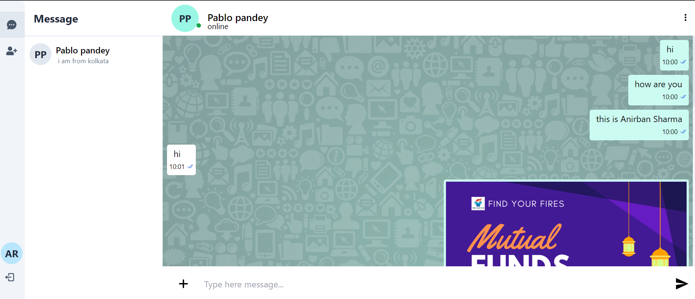

# Insta Chat

## Description

The Insta Chat is a real-time messaging platform that allows users to sign up and connect with strangers for one-on-one conversations. The app is designed to provide a seamless and intuitive user experience, enabling users to exchange text messages and share images effortlessly.

### Key Features

1. **User Authentication:**
   - Users can sign up and log in to the application to start chatting with others. User authentication ensures that only registered users can access the chat features.

2. **Real-Time Messaging:**
   - The core functionality of the app allows users to send and receive messages in real-time. Messages are delivered instantly, ensuring a smooth and responsive chat experience.

3. **Stranger Chat:**
   - Users are randomly matched with strangers to initiate conversations, making each interaction unique and spontaneous.

4. **Image Sharing:**
   - Beyond text, users can also share images during their chats, adding a visual element to their conversations.

5. **Seen Message Indicator:**
   - Users can see when their messages have been viewed by the recipient, enhancing the communication flow.
  
6. **Reply to a Message :**
   - Users can reply to a particular message.

7. **Upload selfie  :**
   - Beyond text, users can also share selfie during their chats, adding a visual element to their conversations.
  
8. **Edit Text :**
   - Users can also edit their messages.
  
9. **Delete Text :**
   - Users can also Delete their messages.
  
10. **Send Voice Messages :**
   - Beyond Texts , users can also send Voice messages.

### Technologies Used

- **Frontend:** React.js
- **Backend:** Node.js, Express.js
- **Real-Time Communication:** Socket.io
- **Database:** MongoDB
- **Authentication:** JSON Web Tokens (JWT)
- **File Uploads:** Cloudinary (or any other file storage service)
